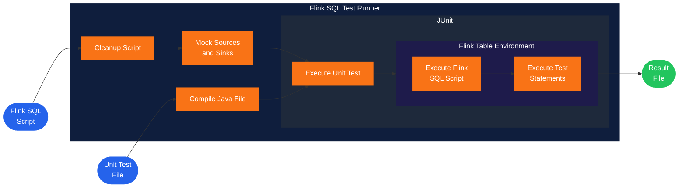
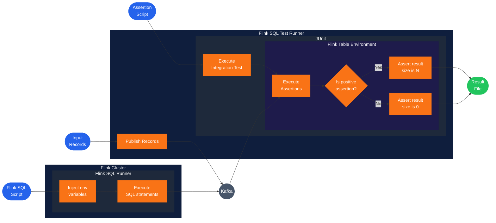

# flink-sql-assert-runner

[](https://github.com/acosom/flink-sql-assert-runner/actions/workflows/ci.yml?query=branch%3Aflink-1.20)
[](https://www.apache.org/licenses/LICENSE-2.0)
[](https://openjdk.org/projects/jdk/17/)
[](https://flink.apache.org/)
[](https://github.com/acosom/flink-sql-assert-runner/tags)
[](https://github.com/acosom/flink-sql-assert-runner/pulls)

A test harness for [Apache Flink](https://flink.apache.org/) SQL pipelines. Define
test scenarios and assertions as plain SQL files; the runner publishes Avro
fixtures to Kafka, deploys your Flink SQL job, runs assertion queries against
the resulting state, and reports pass/fail.

Two complementary modes:

- **Integration tests** — exercise the full pipeline end-to-end (Kafka source →
  Flink job → Kafka sink) with assertions written as SQL `SELECT` statements
  against the live result topics.
- **Unit tests** — exercise a Flink SQL script in isolation, in-process, using
  an [Apache Paimon](https://paimon.apache.org/) catalog as a test backend so
  no external Kafka or Schema Registry is required.

License: Apache 2.0.

---

## Flink version compatibility

The runner ships Flink client libraries that talk to your cluster (REST API,
RPC serializers, SQL parser). Protocol and API surface drifts between Flink
minor releases, so **a runner build is pinned to one Flink major.minor and
will not work against other Flink versions**.

Pick the branch and tag matching your cluster's Flink:

| Branch         | Flink line | Java | Maven version           | Tag prefix          |
|----------------|------------|------|-------------------------|---------------------|
| `main`         | 2.0.x      | 17   | `0.1.0-flink-2.0`       | `vX.Y.Z-flink-2.0`  |
| `flink-1.20`   | 1.20.x     | 17   | `0.1.0-flink-1.20`      | `vX.Y.Z-flink-1.20` |

- Patch-level Flink bumps (e.g. 2.0.1 → 2.0.2) **do not** require a runner
  rebuild — same runner tag works.
- Minor bumps (1.20 → 1.21) or major bumps (1.x → 2.x) **do** — switch to the
  runner branch matching your target Flink.
- Bug fixes land first on `main`, then get cherry-picked to maintained
  `flink-X.Y` branches.

---

## Table of contents

- [Unit testing](#unit-testing)
- [Integration testing](#integration-testing)
- [Quick start (Docker Compose)](#quick-start-docker-compose)
- [Configuration reference](#configuration-reference)
- [Building from source](#building-from-source)
- [Project structure](#project-structure)
- [Contributing](#contributing)

---

## Unit testing

Unit tests exercise your Flink SQL script **in-process, against the real
Flink runtime, without any external Kafka, Schema Registry, or other
infrastructure**. The same SQL you ship to production is the SQL the unit
test runs — there is no shadow pipeline, no parallel Java implementation,
no hand-written mocks.

### How it works

The runner reuses your production Flink SQL by **swapping out the I/O
layer** at table-creation time:

- The runner parses each `CREATE TABLE … WITH ('connector' = 'kafka', …)`
  statement and **removes the `WITH (…)` clause entirely** before handing
  it to Flink — no empty parens left, just `CREATE TABLE foo (… columns …);`.
- An [Apache Paimon](https://paimon.apache.org/) catalog rooted at a temp
  directory is registered as the **active catalog** via `USE CATALOG`. In
  Flink SQL, a `CREATE TABLE` without a `WITH (…)` clause defaults to the
  active catalog's storage — so the now-connector-less table lands in
  Paimon's in-process file storage. The pipeline SQL itself is unchanged
  on disk; the rewrite happens in memory before the statement reaches the
  planner.
- `CREATE VIEW` is rewritten to `CREATE TEMPORARY VIEW` so it lives only
  for the test.
- `ADD JAR` statements are dropped (UDF JARs are loaded a different way in
  unit mode).

The SQL parser, planner, optimizer, and operator runtime are all the
**real Flink runtime** — only the source/sink connectors are replaced.
Sources become tables you `INSERT INTO` directly from the test; sinks
become tables you `SELECT FROM` to make assertions.

### Why Paimon?

Two pieces have to line up for the swap to work: somewhere to store table
data without external services, and a backend the Flink planner treats
exactly like a real connector. [Apache Paimon](https://paimon.apache.org/)
(formerly Flink Table Store) is both.

A Flink **catalog** is the metastore the SQL planner consults to resolve
`db.table` references — schemas, properties, and where the data lives.
The default in-memory catalog only holds metadata for the session; Paimon
ships its own catalog implementation that also persists the data itself,
as Parquet/ORC files indexed by an LSM-style manifest, in any directory
you point it at. For unit tests that directory is a per-test temp dir, so
state is fresh on every run and cleaned up automatically.

Why Paimon specifically, and not a generic filesystem connector or an
in-memory table:

- **Changelog-native.** Flink SQL pipelines that do `GROUP BY`, joins,
  deduplication, or temporal aggregations emit *retract streams* — rows
  tagged `+I` / `+U` / `-U` / `-D`. Paimon supports primary keys and
  UPDATE/DELETE semantics out of the box. An append-only filesystem
  connector would crash the moment the pipeline retracted a row.
- **Streaming and batch reads on the same table.** Your sink can be
  written as a streaming insert and immediately read as a finite snapshot
  in the same test — no pipeline rewrite, no separate fixture format.
- **No external services.** The catalog is a directory; no Hive metastore,
  no JDBC server, no daemon, no port to allocate. Tests run anywhere a
  JVM does.
- **Same Flink SPI as production sinks.** Paimon plugs into Flink via the
  same `DynamicTableSource` / `DynamicTableSink` / `Catalog` interfaces a
  Kafka or JDBC connector does, so the planner generates an equivalent
  query plan against either. What you test is what runs in prod.

### Runtime test compilation

Test classes themselves are **plain `.java` source files** that the runner
compiles in-process via the JDK's
[javac API](https://docs.oracle.com/en/java/javase/17/docs/api/java.compiler/javax/tools/JavaCompiler.html)
at startup, then loads into a fresh classloader and runs via JUnit 4. You
don't rebuild or redeploy the runner to add a test — drop a new
`MyJobTest.java` next to the SQL script, mount the folder into the runner
container, and the next run picks it up.

### Flow



### Layout

```
📂 unit
├── 📂 script
│   └── 📄 my-job.sql        # the Flink SQL job under test
└── 📂 test
    └── 📄 MyJobTest.java     # JUnit 4 test class
```

### Example test

```java
import org.junit.Assert;
import org.junit.Test;
import io.acosom.flink.assertrunner.unit.FlinkSqlTestCase;

public class MyJobTest extends FlinkSqlTestCase {

    @Override
    public String getScriptName() {
        return "my-job.sql";
    }

    @Test
    public void filtersToActiveRows() {
        tEnv.executeSql("INSERT INTO INPUT_TABLE VALUES ('1', 'active'), ('2', 'inactive')");

        var rows = selectRowsWithTimeout("OUTPUT_TABLE", 1);

        Assert.assertEquals(1, rows.size());
    }
}
```

On `@Before`, `FlinkSqlTestCase`:

1. Creates a fresh Paimon catalog rooted at a temp directory and switches
   to it with `USE CATALOG paimon`.
2. Reads your SQL script and rewrites it for in-process execution: strips
   `ADD JAR` statements, removes `WITH (...)` connector clauses entirely
   (so the active Paimon catalog backs the tables), and converts
   `CREATE VIEW` → `CREATE TEMPORARY VIEW`.
3. Executes the rewritten statements against the test
   `StreamTableEnvironment` (exposed to your test as `tEnv`).

You then write `INSERT` statements for fixture data and use the helpers
below to read results back out of the sink.

### Test helpers

A Flink streaming `SELECT` is unbounded — without a stopping condition it
never returns. `FlinkSqlTestCase` provides two helpers that wrap
`tEnv.executeSql("SELECT * FROM <table>")` in a bounded collect-loop, both
returning `List<Row>`:

```java
List<Row> selectRowsWithTimeout(String table, Integer expectedSize)
List<Row> selectRowsWithTimeout(String table, Integer expectedSize, Integer timeoutInSeconds)
List<Row> selectAllRowsWithTimeout(String table, Integer timeoutInSeconds)
```

| Argument             | What it means                                                                                              |
|----------------------|------------------------------------------------------------------------------------------------------------|
| `table`              | Table or view name to `SELECT * FROM`.                                                                     |
| `expectedSize`       | **Early-exit threshold.** Stop polling as soon as this many rows have been collected. Lets a passing test return fast instead of always waiting out the full timeout. |
| `timeoutInSeconds`   | Hard upper bound. The collector cancels and returns whatever it has gathered so far when this fires. Default `15` for the two-arg overload. |

`selectAllRowsWithTimeout` has no early exit — it always waits the full
`timeoutInSeconds` and returns everything that showed up. Use it when
you want to assert that *only* N rows appeared (i.e. no rows leaked in
after the ones you expected).

Typical patterns:

```java
// "I expect exactly 1 row in OUTPUT_TABLE" — returns fast on success,
// times out after 15s on failure.
var rows = selectRowsWithTimeout("OUTPUT_TABLE", 1);
Assert.assertEquals(1, rows.size());

// "I expect 10 rows but the pipeline may be slow; give it 60s."
var rows = selectRowsWithTimeout("OUTPUT_TABLE", 10, 60);

// "After 5s nothing more should show up — assert no leakage."
var rows = selectAllRowsWithTimeout("OUTPUT_TABLE", 5);
Assert.assertEquals(3, rows.size());
```

Note the **early-exit caveat**: `selectRowsWithTimeout(table, N)` returns
as soon as `N` rows are seen, so it can't catch *over-production* (the
pipeline emitting `N+1` rows when it should emit exactly `N`). When you
need an exact-count assertion, prefer `selectAllRowsWithTimeout` so the
collector keeps reading until the timeout.

---

## Integration testing

Integration tests exercise the full pipeline end-to-end. Your real Flink
SQL job runs on a real Flink cluster, reading from and writing to real
Kafka topics with real Schema Registry encoding. Assertions are written
as additional Flink SQL files and evaluated by the runner against the
live result topics.

### How it works

For each scenario folder under `INTEGRATION_TEST_DATA_DIR`, the runner:

1. **Cancels any running Flink jobs** so each scenario starts clean.
2. **Purges** all configured `INTEGRATION_OUTPUT_TOPICS` and per-scenario
   input topics (delete + recreate) so consumer offsets and stale data
   don't leak between scenarios.
3. **Publishes** the JSON fixtures from `input/<topic>.json` to Kafka,
   encoded as Avro using the schema in `input/schema/<topic>.json` and
   the configured Schema Registry.
4. **Submits** the Flink SQL job. The runner expects a job JAR uploaded
   to the JobManager (typically a SQL-runner such as
   [`flink-sql-runner`](https://github.com/acosom/flink-sql-runner) that
   takes a SQL file path as its argument) with the entrypoint class given
   by `INTEGRATION_FLINK_JOB_ENTRYPOINT_CLASS`.
5. **Validates** in either of two ways:
   - **Output topic snapshot** (optional `output/<topic>.json` files):
     the runner consumes from each topic and checks that at least one of
     the expected messages arrives within a timeout.
   - **SQL assertion** (optional `sqlAssertions/*.sql` files): each file
     is itself a Flink SQL script that defines a `CREATE TABLE` over the
     sink topic and ends with a `SELECT`. The runner submits the
     assertion to the cluster, collects the result rows, and decides
     pass/fail by row count.

SQL assertions are evaluated in one of two modes:

| Mode       | Passes when                                  | Use case                                          |
|------------|----------------------------------------------|---------------------------------------------------|
| `positive` | `SELECT` returns exactly `outputCount` rows  | "the job should emit these N expected records"    |
| `negative` | `SELECT` returns zero rows                   | "this bad-state row must never appear"            |

Because assertions are real Flink jobs reading from real Kafka, they cover
serialization, watermarks, state, retract streams — every behavior an
end-to-end deploy would.

### Flow



### Scenario layout

```
📂 integration
├── 📂 scenario-1
│   ├── 📂 input
│   │   ├── 📂 schema
│   │   │   └── 📄 input_topic.json   # Avro schema (.avsc-style JSON)
│   │   └── 📄 input_topic.json       # array of records to publish
│   ├── 📂 output                      # optional: expected sink topic data
│   │   └── 📄 output_topic.json
│   └── 📂 sqlAssertions               # optional: SQL-based assertions
│       └── 📄 some_check.sql
└── 📂 scenario-2
    └── …
```

### Assertion file format

Each `.sql` file in `sqlAssertions/` is a Flink SQL script with **two
extensions** on top of standard Flink SQL:

**Environment variable substitution.** `@@VAR_NAME@@` placeholders are
replaced with the corresponding environment variable value at runtime.
Single quotes in the value are escaped to `''` so they're safe inside SQL
string literals.

**Inline assertion spec.** Anywhere in the file (typically as a SQL
comment), include `key:value` tokens to control validation:

| Token         | Default    | Meaning                                                                  |
|---------------|------------|--------------------------------------------------------------------------|
| `mode`        | `negative` | `positive` = expect an exact row count; `negative` = expect zero rows.   |
| `outputCount` | `0`        | Number of rows expected in `positive` mode.                              |
| `timeoutMs`   | `10000`    | How long to collect rows before evaluating (overridden by `INTEGRATION_TEST_SUCCESS_TIMEOUT_MS` if set). |

**The last statement in the file must be a `SELECT`** — that's what
produces the rows the runner validates.

#### Negative example

A negative assertion passes when the `SELECT` returns *no* rows. Use it
to assert "this bad state never appears":

```sql
CREATE TABLE OUTPUT_SOURCE (
    id   STRING NOT NULL,
    name STRING NOT NULL
) WITH (
    'connector'    = 'kafka',
    'topic'        = 'output_topic',
    'properties.bootstrap.servers' = '@@INTEGRATION_KAFKA_SERVER@@',
    'properties.group.id' = 'check-1',
    'scan.startup.mode'   = 'earliest-offset',
    'value.format'        = 'avro-confluent',
    'value.avro-confluent.url' = '@@INTEGRATION_SCHEMA_REGISTRY_URL@@'
);

-- mode:negative
SELECT * FROM OUTPUT_SOURCE WHERE id NOT IN ('1', '2', '3');
```

#### Positive example

A positive assertion passes when the row count matches `outputCount`:

```sql
-- … same CREATE TABLE …

SELECT * FROM OUTPUT_SOURCE; -- mode:positive outputCount:2
```

---

## Quick start (Docker Compose)

A reference `docker-compose.yaml` boots Kafka, an Apicurio Schema Registry
(Confluent-compatible), Kafka UI, and a Flink session cluster on the
Flink-version that matches this branch.

1. **Drop your Flink SQL job JAR into `./flink-jars/`.** This is the JAR your
   cluster will run — typically a SQL-runner that takes a SQL file path as
   its argument (e.g. one built from
   [`flink-sql-runner`](https://github.com/getindata/flink-sql-runner) or your
   own implementation). The runner's `INTEGRATION_FLINK_JOB_ENTRYPOINT_CLASS`
   env var must match this JAR's main class.

2. **Adjust `integration.env`** for your scenario (Kafka topics, Flink job
   entrypoint class, etc.).

3. **Boot the supporting services:**

    ```bash
    docker compose up -d kafka_broker apicurio jobmanager taskmanager
    ```

4. **Build and run the assert runner:**

    ```bash
    mvn package -DskipTests
    set -a; source integration.env; set +a
    java -jar target/flink-sql-assert-runner.jar
    ```

   Or via the Docker image:

    ```bash
    mvn jib:dockerBuild
    docker run --rm --network=host --env-file=integration.env \
        flink-sql-assert-runner
    ```

---

## Configuration reference

All settings come from environment variables. The CLI also accepts
`--unit` / `--result-file` overrides — run with `--help` for the full list.

### Common

| Variable          | Required | Purpose                                                  |
|-------------------|----------|----------------------------------------------------------|
| `RESULT_FILE`     | yes      | Path where the human-readable result summary is written. |
| `RUN_UNIT_TESTS`  | no       | `true` to run unit tests; defaults to `false`.           |

### Integration

| Variable                                 | Required | Purpose                                                        |
|------------------------------------------|----------|----------------------------------------------------------------|
| `INTEGRATION_TEST_DATA_DIR`              | yes      | Directory containing one folder per scenario.                  |
| `INTEGRATION_KAFKA_SERVER`               | yes      | Bootstrap servers, e.g. `localhost:9092`.                      |
| `INTEGRATION_SCHEMA_REGISTRY_URL`        | yes      | Confluent-compatible Schema Registry URL.                      |
| `INTEGRATION_FLINK_JOBMANAGER_SERVER`    | yes      | Flink JobManager REST URL, e.g. `http://localhost:8081`.       |
| `INTEGRATION_TEST_JOB_SQL_FILE`          | yes      | SQL file passed as the program argument to your job JAR (resolved as `/opt/flink/sql/<value>`). |
| `INTEGRATION_FLINK_JOB_ENTRYPOINT_CLASS` | yes      | Main class of the Flink job JAR you uploaded.                  |
| `INTEGRATION_OUTPUT_TOPICS`              | no       | Comma-separated list of sink topics to purge before each run.  |
| `INTEGRATION_TEST_SUCCESS_TIMEOUT_MS`    | no       | Global timeout for a SQL assertion's `SELECT`. Default `10000`.|

### Unit

| Variable                     | Required | Default          | Purpose                                              |
|------------------------------|----------|------------------|------------------------------------------------------|
| `UNIT_TEST_JAVA_DIR`         | yes      | `/app/test`      | Directory containing `*.java` test classes.          |
| `UNIT_TEST_SQL_DIR`          | no       | `/opt/flink/sql` | Directory the test classes reference for SQL scripts.|
| `UNIT_TEST_INPUT_EVENTS_DIR` | no       | `/app/input`     | Directory for fixture data used by tests.            |

---

## Building from source

### Prerequisites

- JDK 17
- Maven 3.8+
- Docker (only required for `mvn verify`, which runs the integration test
  suite against ephemeral Kafka/Flink containers)

### Commands

```bash
# Compile, run unit tests
mvn test

# Compile, run unit + IT + E2E tests (slower, needs Docker)
mvn verify

# Build the fat JAR
mvn package

# Build a Docker image
mvn jib:dockerBuild
```

The fat JAR lands at `target/flink-sql-assert-runner.jar`.

### Running the test suite

The repository's own test suite has three tiers:

| Tier              | What it covers                                                                | Runs in      |
|-------------------|-------------------------------------------------------------------------------|--------------|
| Unit (`*Test.java`) | Pure-logic classes: parsing, templating, config, reporting.                  | `mvn test`   |
| IT (`*IT.java`)   | Kafka publish/verify/admin against a Kafka + Schema Registry container pair.  | `mvn verify` |
| E2E (`*IT.java` in `e2e/`) | `JobController` against a real Flink session cluster (JM + TM containers) on the version pinned in `pom.xml`. | `mvn verify` |

If you're on Docker 29+ and tests fail with `client version 1.32 is too old`,
the failsafe configuration already sets `-Dapi.version=1.45` to work around the
bundled docker-java client.

---

## Project structure

```
src/main/java/io/acosom/flink/assertrunner/
├── cli/             # Picocli entry point (AssertRunnerCli)
├── config/          # RunnerConfig, IntegrationConfig, UnitConfig, ConfigLoader
├── assertion/       # AssertionProperties, AssertionSpecParser, mode/field enums
├── template/        # @@VAR@@ environment templating
├── flink/           # JobController + SqlAssertionExecutor
├── kafka/           # KafkaFixtureLoader, KafkaOutputVerifier, TopicAdmin
├── integration/     # IntegrationSuite + IntegrationContext (drives a scenario)
├── unit/            # FlinkSqlTestCase, UnitSuiteRunner, compile/JavaCompilerUtil
├── report/          # TextResultReporter (writes the result file)
└── error/           # Typed exceptions (AssertRunnerException et al)
```

---

## Contributing

PRs welcome. Quick rules:

- Run `mvn test` before pushing. If your change touches Kafka I/O,
  Flink REST plumbing, or the SQL assertion executor, also run `mvn verify`.
- Pin the Flink version constraint at the top: changes that break wire/protocol
  compatibility need to land on `main` (latest Flink) and be cherry-picked to
  the relevant `flink-X.Y` branch with adjustments.
- Keep public API changes deliberate — this project is pre-1.0 but downstream
  Flink SQL test suites get tied to method signatures quickly.
- New behavior should land with a test pinning it.

For larger changes, open an issue first to discuss direction.
